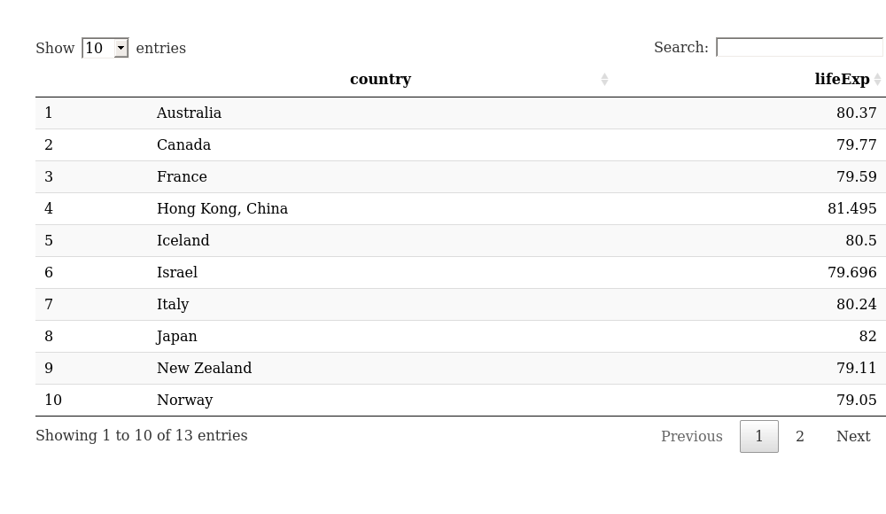

hw01\_gapminder
================

## Exploring the gapminder dataset

*Below we are going to present some different pieces of information in
the gapminder
dataset.*

### Display countries with life expectancies above 79 years old in 2002

``` r
datatable(as_tibble(gapminder[which(gapminder$year == 2002 & gapminder$lifeExp > 79), c(1, 4)]))
```

<!-- -->

### Print the total number of countries studied in the gapminder dataset

``` r
length(unique(gapminder$country))
```

    ## [1] 142
