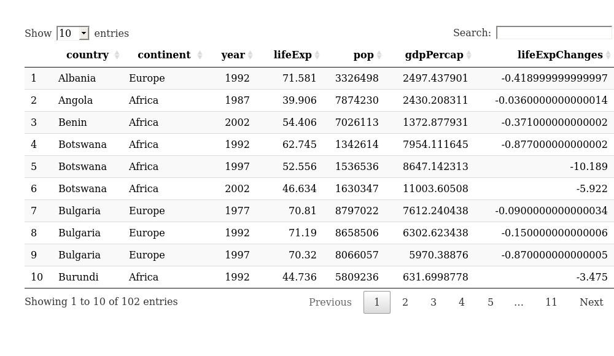
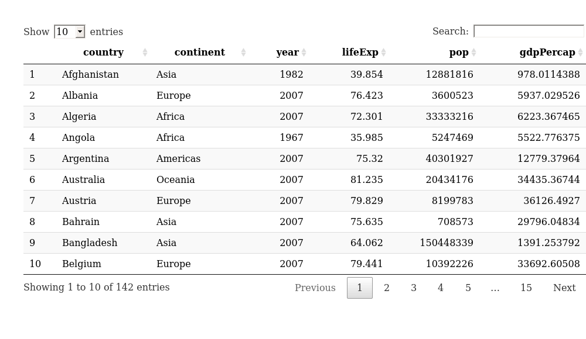
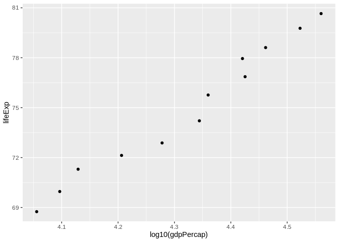
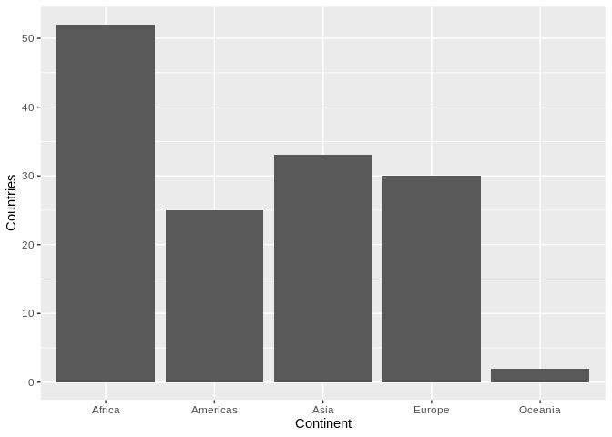
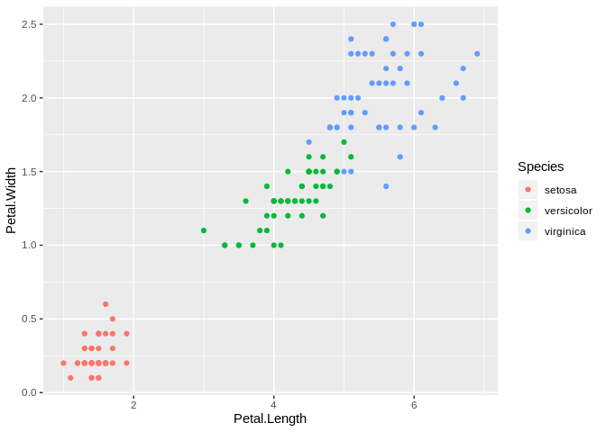
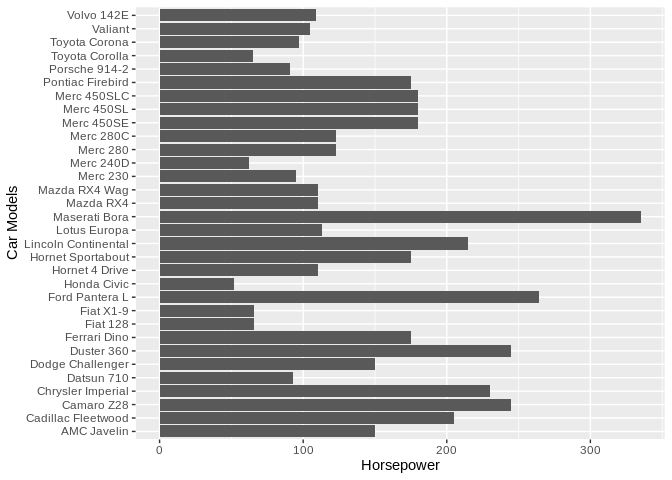

HW02\_dplyr
================

## Exercise 1

### Display gapminder dataset for 3 countries in 1970s

``` r
gapminder %>% 
  filter(country %in% c("Austria", "Belgium", "Australia"),
         year %in% c(1970:1979)) %>% 
  as.tibble() %>% 
  knitr::kable()
```

| country   | continent | year | lifeExp |      pop | gdpPercap |
| :-------- | :-------- | ---: | ------: | -------: | --------: |
| Australia | Oceania   | 1972 |   71.93 | 13177000 |  16788.63 |
| Australia | Oceania   | 1977 |   73.49 | 14074100 |  18334.20 |
| Austria   | Europe    | 1972 |   70.63 |  7544201 |  16661.63 |
| Austria   | Europe    | 1977 |   72.17 |  7568430 |  19749.42 |
| Belgium   | Europe    | 1972 |   71.44 |  9709100 |  16672.14 |
| Belgium   | Europe    | 1977 |   72.80 |  9821800 |  19117.97 |

### Display the above table with only country and GDP Per Capita information

``` r
gapminder %>% 
  filter(country %in% c("Austria", "Belgium", "Australia"),
         year %in% c(1970:1979)) %>%
  select(country, gdpPercap) %>% 
  as.tibble() %>% 
  knitr::kable()
```

| country   | gdpPercap |
| :-------- | --------: |
| Australia |  16788.63 |
| Australia |  18334.20 |
| Austria   |  16661.63 |
| Austria   |  19749.42 |
| Belgium   |  16672.14 |
| Belgium   |  19117.97 |

### Display entries in which countries experienced decrease in life expectancies

``` r
gapminder %>%
  group_by(country) %>% 
  mutate(lifeExpChanges = c(0,diff(lifeExp))) %>% 
  filter(lifeExpChanges < 0) %>% 
  as.tibble() %>% 
  DT::datatable()
```

<!-- -->

### Display entries in which countries had their highest GDP per capita

``` r
gapminder %>% 
  group_by(country) %>% 
  filter(gdpPercap == max(gdpPercap)) %>% 
  as.tibble() %>% 
  DT::datatable()
```

<!-- -->

### Plot life expectancies vs GDP per capita in Canada

``` r
gapminder %>% 
  filter(country == "Canada") %>% 
  ggplot(aes(x = log10(gdpPercap), y = lifeExp)) + 
  geom_point()
```

<!-- -->

## Exercise 2

### List all the continents surveyed in the gapminder dataset

``` r
as.character(unique(gapminder$continent))
```

    ## [1] "Asia"     "Europe"   "Africa"   "Americas" "Oceania"

### Display the number of countries surveyed per continent

``` r
as.data.frame(table(gapminder$continent)) %>% 
  mutate(Countries = Freq/12) %>% 
  ggplot(aes(x = Var1, y = Countries)) + 
  geom_bar(stat = "identity") +
  xlab("Continent")
```

<!-- -->

### Show the minimum and maximum population value in the gapminder dataset

``` r
paste("Min: ", min(gapminder$pop), ", Max: ", max(gapminder$pop), sep = "")
```

    ## [1] "Min: 60011, Max: 1318683096"

### Summary statistics of the population continuous variable in the gapminder dataset

``` r
summary(gapminder$pop)
```

    ##      Min.   1st Qu.    Median      Mean   3rd Qu.      Max. 
    ## 6.001e+04 2.794e+06 7.024e+06 2.960e+07 1.959e+07 1.319e+09

## Exercise 3

### Plotting the correlation of Petal width and length across three different flower species from the iris dataset

``` r
iris %>% 
  ggplot(aes(x = Petal.Length, y = Petal.Width, color = Species)) +
  geom_point()
```

<!-- -->

### Plotting the horsepower of different car models from the mtcars dataset

``` r
mtcars %>% 
  ggplot(aes(x = rownames(mtcars), y = hp)) +
  geom_bar(stat = "identity") +
  coord_flip() +
  xlab("Car Models") +
  ylab("Horsepower")
```

<!-- -->
