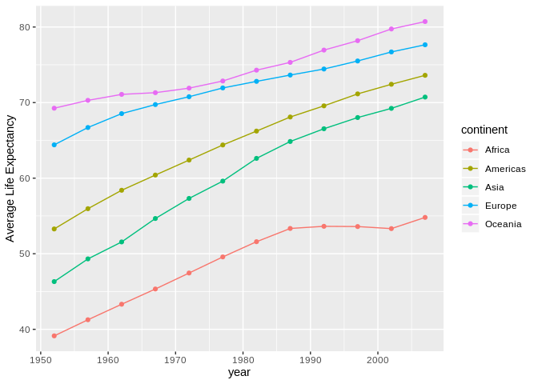

hw03 Tasks 1-3
================

## Task 1: Get the maximum and minimum of GDP per capita for all continents

``` r
gapminder %>% 
  group_by(continent) %>% # group rows into chunks by continent
  summarise(min_gdpPercap = min(gdpPercap),
            max_gdpPercap = max(gdpPercap)) %>% # find maximum and minimum gdpPercap values
  as_tibble() %>% # convert data into a tibble
  knitr::kable()
```

| continent | min\_gdpPercap | max\_gdpPercap |
| :-------- | -------------: | -------------: |
| Africa    |       241.1659 |       21951.21 |
| Americas  |      1201.6372 |       42951.65 |
| Asia      |       331.0000 |      113523.13 |
| Europe    |       973.5332 |       49357.19 |
| Oceania   |     10039.5956 |       34435.37 |

## Task 2: Look at the spread of GDP per capita within the continents

``` r
gapminder %>% 
  ggplot(aes(gdpPercap, continent)) + # specify x and y aesthetics
  scale_x_log10(label = scales::comma_format()) + # log transform and label in comma format
  ggridges::geom_density_ridges() + # add ridges layer to plot
  xlab("Log10(gdpPerCap)") # modify x axis label
```

<!-- -->

## Task 3: Changes in life expectancy over time on different continents

``` r
gapminder %>% 
  group_by(continent, year) %>% # group rows into chunks by continent and year
  summarise(average_lifeExp = mean(lifeExp)) %>% # average life expectancies for each continent
  ggplot(aes(year, average_lifeExp, color = continent)) + # specify the x and y aesthetics
  geom_point() + # create points for each data point
  geom_line() + # connect the data points via a line
  ylab("Average Life Expectancy") # modify the y axis label
```

<!-- -->

``` r
gapminder %>% 
  ggplot(aes(year, lifeExp, color = continent, group = country)) + # specifiy x, y, color, and group aesthetics
  facet_wrap(~continent, nrow = 1) + # create multiple panels
  geom_point(alpha = 0.5) + # create data points with 50% transparency
  geom_line(alpha = 0.5) + # connect the data points via a line with 50% transparency
  theme(legend.position = "bottom") # move the legend to the bottom of the plot
```

<!-- -->
