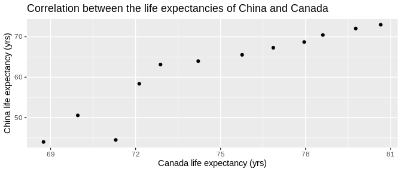

Homework 04 Submission
================
Jimmy Liu
2019-10-08

# Exercise 1

## Widen gapminder dataset by creating a lifeExp column for each country

``` r
gapminder_wide <- gapminder %>% 
  filter(country %in% c("Canada", "China")) %>% # Filter for rows with Canada or China
  pivot_wider(id_cols = c(country, year), # Keep countries and year columns
              values_from = lifeExp, # Cells of new columns will contain lifeExp values
              names_from = country) # Newly generated columns are named by the values
                                    # of the country column

gapminder_wide %>% 
  knitr::kable() # Present the transformed tibble in a nice table
```

| year | Canada |    China |
| ---: | -----: | -------: |
| 1952 | 68.750 | 44.00000 |
| 1957 | 69.960 | 50.54896 |
| 1962 | 71.300 | 44.50136 |
| 1967 | 72.130 | 58.38112 |
| 1972 | 72.880 | 63.11888 |
| 1977 | 74.210 | 63.96736 |
| 1982 | 75.760 | 65.52500 |
| 1987 | 76.860 | 67.27400 |
| 1992 | 77.950 | 68.69000 |
| 1997 | 78.610 | 70.42600 |
| 2002 | 79.770 | 72.02800 |
| 2007 | 80.653 | 72.96100 |

## Create a scatterplot of life expectancies in Canada vs China

``` r
gapminder_wide %>% 
  ggplot(aes(x = Canada, y = China)) + # Specify the x and y variables for ggplot
  geom_point() + # Add point aesthetics for each data point
  xlab("Canada life expectancy (yrs)") + # label x axis
  ylab("China life expectancy (yrs)") + # label y axis
  ggtitle("Correlation between the life expectancies of China and Canada")
```

<!-- -->

## Re-lengthen the widen gapminder dataset

``` r
gapminder_wide %>% 
  pivot_longer(cols = (-year), # Select all columns except year to be collapsed
               names_to = "country", # Collapse Canada and China columns to 
                                     # a column called "country"
               values_to = "lifeExp") %>% # Values of Canda and China columns
                                          # will be under a column called "lifeExp" 
  DT::datatable() # Present the transformed tibble in a nice table
```

<!-- -->

# Exercise 2

## Widen gapminder dataset by creating lifeExp and gdpPerCap columns for each country

``` r
gapminder_wide <- gapminder %>% 
 filter(country %in% c("Canada", "China")) %>% # Filter for rows with Canada or China
 pivot_wider(id_cols = c(country, year), # Keep countries and year columns
             names_from = country, # Newly generated columns are named by
                                   # the values of the country column
             names_sep = "_", # Each new column name is separated by "_"
             values_from = c(lifeExp, gdpPercap)) # Cells of the new columns will contain
                                                  # either lifeExp or gdpPerCap values

gapminder_wide %>% 
  knitr::kable() # Present the transformed tibble in a nice table
```

| year | lifeExp\_Canada | lifeExp\_China | gdpPercap\_Canada | gdpPercap\_China |
| ---: | --------------: | -------------: | ----------------: | ---------------: |
| 1952 |          68.750 |       44.00000 |          11367.16 |         400.4486 |
| 1957 |          69.960 |       50.54896 |          12489.95 |         575.9870 |
| 1962 |          71.300 |       44.50136 |          13462.49 |         487.6740 |
| 1967 |          72.130 |       58.38112 |          16076.59 |         612.7057 |
| 1972 |          72.880 |       63.11888 |          18970.57 |         676.9001 |
| 1977 |          74.210 |       63.96736 |          22090.88 |         741.2375 |
| 1982 |          75.760 |       65.52500 |          22898.79 |         962.4214 |
| 1987 |          76.860 |       67.27400 |          26626.52 |        1378.9040 |
| 1992 |          77.950 |       68.69000 |          26342.88 |        1655.7842 |
| 1997 |          78.610 |       70.42600 |          28954.93 |        2289.2341 |
| 2002 |          79.770 |       72.02800 |          33328.97 |        3119.2809 |
| 2007 |          80.653 |       72.96100 |          36319.24 |        4959.1149 |

### Re-lengthen the widen gapminder dataset

``` r
gapminder_wide %>% 
  pivot_longer(cols = (-year), # Collapse all columns except the year column
               names_sep = "_", # Split the column names by "_"
               names_to = c(".value", "country")) %>% # Collapse selected columns
                                                      # and create 3 new columns
  DT::datatable() # Present the transformed tibble in a nice table
```

<!-- -->

# Exercise 3

``` r
guest <- read_csv("../data/wedding/attend.csv")
email <- read_csv("../data/wedding/emails.csv")
```

## Merge the email column to the guest dataset

``` r
guest %>% 
  rename("guest" = name) %>% # rename the name variable to "guest"
  left_join((email %>% 
               separate_rows("guest", sep = ", ")), # split values in the guest 
                                                    # variable into separate rows
            by = "guest") %>% # merge by the guest variable
  select(party, guest, email) %>% # Only keep the party, guest and email columns
  DT::datatable() # Present the new tibble in a nice table
```

<!-- -->

## Report individuals with known emails but not on guest list

``` r
email %>% 
  rename("name" = guest) %>% # rename the guest variable to "name"
  select(name) %>% # keep the name variable only
  separate_rows("name", sep = ", ") %>% # split values in the name 
                                        # variable into separate rows
  setdiff(guest %>% # find values in the email tibble not 
                    # in the guest tibble
            select(name)) %>%
  knitr::kable() # present the new tibble in a nice table
```

| name            |
| :-------------- |
| Turner Jones    |
| Albert Marshall |
| Vivian Marshall |

## Report everyone in the guest and email datasets

``` r
email %>% 
  rename("name" = guest) %>% # rename the guest variable to "name"
  select(name) %>% # keep the name variable only
  separate_rows("name", sep = ", ") %>% # split values in the name variable into separate rows
  union(guest %>% # join all values found in the email and guest tibble into a single tibble
            select(name)) %>% 
  DT::datatable() # present the new tibble in a nice table
```

<!-- -->
