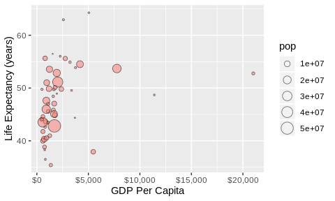

hw05
================
Jimmy Liu
16/10/2019

# Purpose of here() package

The here() package is a convenient tool that enables easy sharing of R
scripts. In the case when a project session is not opened, any R scripts
assumes a default working directory which can be slightly different
depending on the users accessing the scripts. Moreover, it is
impractical to begin a script with setwd() to specify the path to the
current working directory, as the directory structure varies between
different devices and operating systems. These issues render R scripts
unable to run smoothly if it requires access to files in particular
directories. The here() package addresses the issues by looking for
.Rproj project files in the current or parent directories of the R
script being accessed and assumes the directory where .Rproj files are
found to be the current working directory.

# Explore factors with gapminder dataset

The gapminder dataset is filtered to remove observations in Oceania and
summarized to find the highest GDP per Capita values in each continent.
The level corresponding to “Oceania” in the continent factor is removed.

``` r
p <- gapminder %>% 
  filter(continent != "Oceania") %>% 
  droplevels() %>% 
  group_by(continent) %>% 
  summarize(max_gdpPercap = max(gdpPercap))
```

A barplot is created using the above tibble while maintaining the
original factor levels in the continent factor.

``` r
p %>% 
  ggplot(aes(x = continent, y = max_gdpPercap)) +
  geom_bar(stat = "identity")
```

<!-- -->

A barplot is created with the same tibble, but now the continent factor
is rearranged based on their highest GDP per Capita values.

``` r
p %>% 
  ggplot(aes(x = fct_reorder(continent, max_gdpPercap), y = max_gdpPercap)) +
  geom_bar(stat = "identity")
```

<!-- -->

# Exploring file input and output

Modify the gapminder dataset by summarizing the average life
expectancies across all countries and years in each continent and
subsequently rearranging the continent factor by their average life
expectancies.

``` r
# Modify the gapminder dataset
p <- gapminder %>% 
  group_by(continent) %>% 
  summarize(lifeExp_mean = mean(lifeExp))
p$continent <- fct_reorder(p$continent, p$lifeExp_mean)

p
```

    ## # A tibble: 5 x 2
    ##   continent lifeExp_mean
    ##   <fct>            <dbl>
    ## 1 Africa            48.9
    ## 2 Americas          64.7
    ## 3 Asia              60.1
    ## 4 Europe            71.9
    ## 5 Oceania           74.3

Write out the modified gapminder as a csv. The csv file is then
re-imported back and the dataset is printed to demonstrate that
read\_csv() ran successfully.

``` r
# Write out csv
write_csv(p, here("hw05", "gapminder_modified.csv"))

# Read back csv
read_csv(here("hw05", "gapminder_modified.csv"))
```

    ## # A tibble: 5 x 2
    ##   continent lifeExp_mean
    ##   <chr>            <dbl>
    ## 1 Africa            48.9
    ## 2 Americas          64.7
    ## 3 Asia              60.1
    ## 4 Europe            71.9
    ## 5 Oceania           74.3

# Improving visualization design

From the visualization design lecture, we learned it is best to keep
figures and plots as simple as possible to prevent particular features
from distracting the audience. From the original plot, the grid lines
and gray background was removed. The self-explainatory axis and legend
titles were removed. A single plot title was included to clarify the
variables used in the plot. Overall the revised plot is much cleaner and
allows the audience to focus on the trends and data shown rather than
distracted by unnecessary features in the original plot.

``` r
# Original Plot
gapminder %>%
  group_by(continent, year) %>% 
  summarize(mean_lifeExp = mean(lifeExp)) %>% 
  ggplot(aes(x = year, y = mean_lifeExp, color = continent)) +
  geom_line() +
  geom_point()
```

<!-- -->

``` r
# Revised Plot
gapminder %>%
  group_by(continent, year) %>% 
  summarize(mean_lifeExp = mean(lifeExp)) %>% 
  ggplot(aes(x = year, y = mean_lifeExp, color = continent)) +
  geom_smooth(se = F) +
  theme(panel.grid.major = element_blank(), panel.grid.minor = element_blank(),
        panel.background = element_blank(), axis.line = element_line(colour = "black"),
        legend.title = element_blank(), axis.title.x=element_blank(), 
        axis.title.y=element_blank()) +
  ggtitle("Global Life Expectancy Trends from 1952")
```

<!-- -->

# Writing figures to file

A bubble plot is created from the gapminder dataset to study the
correlation between GDP per Capita and life expectancy in Africa. The
size of the datapoints represent the population of each country in 1972.
The corresponding plot is saved as “gapminder\_plot\_ggsave.jpg” using
the ggsave() function.

``` r
p <- gapminder %>% 
  filter(continent == "Africa",
         year == "1972") %>% 
  ggplot(aes(gdpPercap, lifeExp, size = pop, fill = continent)) +
  geom_point(alpha = 0.5, shape = 21) +
  scale_x_log10(labels = scales::comma_format()) +
  scale_size_area() +
  guides(fill = FALSE)
ggsave(here("hw05", "gapminder_plot_ggsave.jpg"), p)
plot(p)
```

<!-- -->
